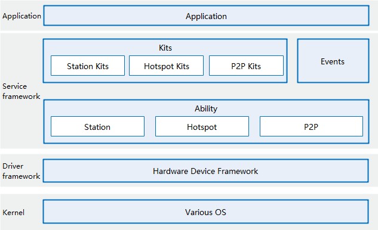

wifi/services/wifi_standard/wifi_framework/wifi_manage/wifi_scan/scan_service.cpp 802
 scanInfo.isHiLinkNetwork = interInfo.isHiLinkNetwork;
    scanInfo.isHiLinkProNetwork = interInfo.isHiLinkProNetwork;1111
    scanInfo.supportedWifiCategory = interInfo.supportedWifiCategory;

wifi/frameworks/native/src/wifi_device_proxy.cpp 1334
info.isHiLinkNetwork = reply.ReadInt32();
    info.isHiLinkProNetwork = reply.ReadBool();11111
    info.lastRxPackets = reply.ReadInt32();
# communication\_wifi<a name="EN-US_TOPIC_0000001162030287"></a>

-   [Introduction](#section11660541593)
-   [Architecture](#section342962219551)
-   [Directory Structure](#section161941989596)
-   [Usage](#section1312121216216)
    -   [Available APIs](#section1551164914237)
    -   [Usage Guidelines](#section129654513264)

-   [Repositories Involved](#section1371113476307)

## Introduction<a name="section11660541593"></a>

A wireless local area network \(WLAN\) uses the radio, infrared, or other technologies to transmit data between devices that are not physically connected with each other. It is widely applied in offices and public places where mobile devices are used.

The WLAN module provides basic WLAN functions, peer-to-peer \(P2P\) connection, and WLAN notification, enabling your application to communicate with other devices through a WLAN.

## Architecture<a name="section342962219551"></a>

**Figure  1**  WLAN architecture<a name="fig356513281301"></a>  




## Directory Structure<a name="section161941989596"></a>

```
/foundation/communication/wifi
├── figures            # Figures
├── interfaces         # APIs
│   ├── innerkits      # Inner APIs
│   └── kits           # WLAN APIs
├── services           # Services
│   └── wifi_standard  # Service implementation
├── tests              # Test code
│   └── wifi_standard  # Test code for the service implementation module
└── utils              # Utility functions
    ├── inc            # Header directory for utility functions
    └── src            # Implementation directory for utility functions
```

## Usage<a name="section1312121216216"></a>

### Available APIs<a name="section1551164914237"></a>

The following table describes JavaScript APIs in  **@ohos.wifi**  available for basic WLAN functions.

**Table  1**  Major JavaScript APIs available for basic WLAN functions

<a name="t96d5b1a809be46328adc684bff001cf7"></a>

<table><thead align="left"><tr id="r5b6b790b6fe144e79e849b7987637f32"><th class="cellrowborder" valign="top" width="27.642764276427638%" id="mcps1.2.4.1.1"><p id="a4bf77d9c2b5c4b8d950a720edaf949c7"><a name="a4bf77d9c2b5c4b8d950a720edaf949c7"></a><a name="a4bf77d9c2b5c4b8d950a720edaf949c7"></a>API</p>
</th>
<th class="cellrowborder" valign="top" width="41.094109410941094%" id="mcps1.2.4.1.2"><p id="a11b93aaf8bfd4305acc4b4549f28d524"><a name="a11b93aaf8bfd4305acc4b4549f28d524"></a><a name="a11b93aaf8bfd4305acc4b4549f28d524"></a>Description</p>
</th>
<th class="cellrowborder" valign="top" width="31.26312631263126%" id="mcps1.2.4.1.3"><p id="a1d9f27631e6f466f8c2edc9833a94275"><a name="a1d9f27631e6f466f8c2edc9833a94275"></a><a name="a1d9f27631e6f466f8c2edc9833a94275"></a>Required Permission</p>
</th>
</tr>
</thead>
<tbody><tr id="r31629b385e294e248c668786519b6f87"><td class="cellrowborder" valign="top" width="27.642764276427638%" headers="mcps1.2.4.1.1 "><p id="aea622edc3df04a60a42bb8a1a63a8c4f"><a name="aea622edc3df04a60a42bb8a1a63a8c4f"></a><a name="aea622edc3df04a60a42bb8a1a63a8c4f"></a>function enableWifi(): boolean</p>
</td>
<td class="cellrowborder" valign="top" width="41.094109410941094%" headers="mcps1.2.4.1.2 "><p id="a799afb666cff4f03a2ee996c0c7335dd"><a name="a799afb666cff4f03a2ee996c0c7335dd"></a><a name="a799afb666cff4f03a2ee996c0c7335dd"></a>Enables WLAN.</p>
</td>
<td class="cellrowborder" valign="top" width="31.26312631263126%" headers="mcps1.2.4.1.3 "><p id="a78809eb41a8e46ec92ad886a2e491e09"><a name="a78809eb41a8e46ec92ad886a2e491e09"></a><a name="a78809eb41a8e46ec92ad886a2e491e09"></a>NA</p>
</td>
</tr>
<tr id="r42d012d5690241a1a346b249bca0d0f4"><td class="cellrowborder" valign="top" width="27.642764276427638%" headers="mcps1.2.4.1.1 "><p id="a3d8f9fb87dd94d5da78f9d59ba31c9ec"><a name="a3d8f9fb87dd94d5da78f9d59ba31c9ec"></a><a name="a3d8f9fb87dd94d5da78f9d59ba31c9ec"></a>function disableWifi(): boolean</p>
</td>
<td class="cellrowborder" valign="top" width="41.094109410941094%" headers="mcps1.2.4.1.2 "><p id="a9d1794f64a4a4177b0c247a5378cc8a3"><a name="a9d1794f64a4a4177b0c247a5378cc8a3"></a><a name="a9d1794f64a4a4177b0c247a5378cc8a3"></a>Disables WLAN. </p>
</td>
<td class="cellrowborder" valign="top" width="31.26312631263126%" headers="mcps1.2.4.1.3 "><p id="a4bba00774fee45b991e03d5739eed45d"><a name="a4bba00774fee45b991e03d5739eed45d"></a><a name="a4bba00774fee45b991e03d5739eed45d"></a>NA</p>
</td>
</tr>
<tr id="rb2088f3bae264f9fb6dee3d69f8e510b"><td class="cellrowborder" valign="top" width="27.642764276427638%" headers="mcps1.2.4.1.1 "><p id="a0db4a8a271844e289867b8686be5971e"><a name="a0db4a8a271844e289867b8686be5971e"></a><a name="a0db4a8a271844e289867b8686be5971e"></a>function isWifiActive(): boolean</p>
</td>
<td class="cellrowborder" valign="top" width="41.094109410941094%" headers="mcps1.2.4.1.2 "><p id="a251c902bc5a14e4dbbf6ae3e847d5a00"><a name="a251c902bc5a14e4dbbf6ae3e847d5a00"></a><a name="a251c902bc5a14e4dbbf6ae3e847d5a00"></a>Checks whether WLAN is enabled.</p>
</td>
<td class="cellrowborder" valign="top" width="31.26312631263126%" headers="mcps1.2.4.1.3 "><p id="ad01b019785b6434aa7b4e06badffda6a"><a name="ad01b019785b6434aa7b4e06badffda6a"></a><a name="ad01b019785b6434aa7b4e06badffda6a"></a>NA</p>
</td>
</tr>
<tr id="r63090caeaf674f2e9a7efdd8f838564c"><td class="cellrowborder" valign="top" width="27.642764276427638%" headers="mcps1.2.4.1.1 "><p id="a9229822a49b6414dbb15ded55b808209"><a name="a9229822a49b6414dbb15ded55b808209"></a><a name="a9229822a49b6414dbb15ded55b808209"></a>function scan(): boolean</p>
</td>
<td class="cellrowborder" valign="top" width="41.094109410941094%" headers="mcps1.2.4.1.2 "><p id="a666bb97e527a4d5db4864d72bdb040b7"><a name="a666bb97e527a4d5db4864d72bdb040b7"></a><a name="a666bb97e527a4d5db4864d72bdb040b7"></a>Starts a WLAN scan.</p>
</td>
<td class="cellrowborder" valign="top" width="31.26312631263126%" headers="mcps1.2.4.1.3 "><p id="abdc11b1866b54d69a8acef2c13da1553"><a name="abdc11b1866b54d69a8acef2c13da1553"></a><a name="abdc11b1866b54d69a8acef2c13da1553"></a>NA</p>
</td>
</tr>
<tr id="r5098f19894e947d9844839c81abdb431"><td class="cellrowborder" valign="top" width="27.642764276427638%" headers="mcps1.2.4.1.1 "><p id="p148521030134915"><a name="p148521030134915"></a><a name="p148521030134915"></a>function getScanInfos(): Promise&lt;Array&lt;WifiScanInfo&gt;&gt;</p>
<p id="p1264072917366"><a name="p1264072917366"></a><a name="p1264072917366"></a>function getScanInfos(callback: AsyncCallback&lt;Array&lt;WifiScanInfo&gt;&gt;): void</p>
</td>
<td class="cellrowborder" valign="top" width="41.094109410941094%" headers="mcps1.2.4.1.2 "><p id="a833c28b165db44e49b49d84eb8f12d3a"><a name="a833c28b165db44e49b49d84eb8f12d3a"></a><a name="a833c28b165db44e49b49d84eb8f12d3a"></a>Obtains the WLAN scan result. This API can be called in either callback or promise mode.</p>
</td>
<td class="cellrowborder" valign="top" width="31.26312631263126%" headers="mcps1.2.4.1.3 "><p id="ad31109a27e344b27a2879ae7be60da6a"><a name="ad31109a27e344b27a2879ae7be60da6a"></a><a name="ad31109a27e344b27a2879ae7be60da6a"></a>NA</p>
</td>
</tr>
<tr id="rd41bbd2a167e42c4854efaf2f95923a8"><td class="cellrowborder" valign="top" width="27.642764276427638%" headers="mcps1.2.4.1.1 "><p id="p126421517153711"><a name="p126421517153711"></a><a name="p126421517153711"></a>function addDeviceConfig(config: WifiDeviceConfig): Promise&lt;number&gt;</p>
<p id="p15642617133717"><a name="p15642617133717"></a><a name="p15642617133717"></a>function addDeviceConfig(config: WifiDeviceConfig, callback: AsyncCallback&lt;number&gt;): void</p>
</td>
<td class="cellrowborder" valign="top" width="41.094109410941094%" headers="mcps1.2.4.1.2 "><p id="a88ec088696df4f4b8e0e240e66646d9c"><a name="a88ec088696df4f4b8e0e240e66646d9c"></a><a name="a88ec088696df4f4b8e0e240e66646d9c"></a>Adds a WLAN hotspot configuration. This API can be called in either callback or promise mode.</p>
</td>
<td class="cellrowborder" valign="top" width="31.26312631263126%" headers="mcps1.2.4.1.3 "><p id="a57539195f93c4af187781c5c7a64c74c"><a name="a57539195f93c4af187781c5c7a64c74c"></a><a name="a57539195f93c4af187781c5c7a64c74c"></a>NA</p>
</td>
</tr>
<tr id="row18665444142915"><td class="cellrowborder" valign="top" width="27.642764276427638%" headers="mcps1.2.4.1.1 "><p id="p666517440295"><a name="p666517440295"></a><a name="p666517440295"></a>function connectToNetwork(networkId: number): boolean</p>
</td>
<td class="cellrowborder" valign="top" width="41.094109410941094%" headers="mcps1.2.4.1.2 "><p id="p13666344152913"><a name="p13666344152913"></a><a name="p13666344152913"></a>Sets up a WLAN based on the hotspot configuration ID.</p>
</td>
<td class="cellrowborder" valign="top" width="31.26312631263126%" headers="mcps1.2.4.1.3 "><p id="p56667442298"><a name="p56667442298"></a><a name="p56667442298"></a>NA</p>
</td>
</tr>
<tr id="row176661944152919"><td class="cellrowborder" valign="top" width="27.642764276427638%" headers="mcps1.2.4.1.1 "><p id="p66661144122919"><a name="p66661144122919"></a><a name="p66661144122919"></a>function connectToDevice(config: WifiDeviceConfig): boolean</p>
</td>
<td class="cellrowborder" valign="top" width="41.094109410941094%" headers="mcps1.2.4.1.2 "><p id="p4666104410298"><a name="p4666104410298"></a><a name="p4666104410298"></a>Sets up a WLAN based on the hotspot configuration.</p>
</td>
<td class="cellrowborder" valign="top" width="31.26312631263126%" headers="mcps1.2.4.1.3 "><p id="p766644420298"><a name="p766644420298"></a><a name="p766644420298"></a>NA</p>
</td>
</tr>
<tr id="r53c17c0621b74f9c9b3915fef99bb64d"><td class="cellrowborder" valign="top" width="27.642764276427638%" headers="mcps1.2.4.1.1 "><p id="p5681182313296"><a name="p5681182313296"></a><a name="p5681182313296"></a>function disconnect(): boolean</p>
</td>
<td class="cellrowborder" valign="top" width="41.094109410941094%" headers="mcps1.2.4.1.2 "><p id="a2939738c548a44838522d7ac772b697a"><a name="a2939738c548a44838522d7ac772b697a"></a><a name="a2939738c548a44838522d7ac772b697a"></a>Disconnects from a WLAN.</p>
</td>
<td class="cellrowborder" valign="top" width="31.26312631263126%" headers="mcps1.2.4.1.3 "><p id="a3862542954ef418b86ba8606721b4d30"><a name="a3862542954ef418b86ba8606721b4d30"></a><a name="a3862542954ef418b86ba8606721b4d30"></a>NA</p>
</td>
</tr>
<tr id="row10868175614302"><td class="cellrowborder" valign="top" width="27.642764276427638%" headers="mcps1.2.4.1.1 "><p id="p586835643012"><a name="p586835643012"></a><a name="p586835643012"></a>function getSignalLevel(rssi: number, band: number): number</p>
</td>
<td class="cellrowborder" valign="top" width="41.094109410941094%" headers="mcps1.2.4.1.2 "><p id="p8868155614306"><a name="p8868155614306"></a><a name="p8868155614306"></a>Obtains the WLAN signal strength.</p>
</td>
<td class="cellrowborder" valign="top" width="31.26312631263126%" headers="mcps1.2.4.1.3 "><p id="p1786825673010"><a name="p1786825673010"></a><a name="p1786825673010"></a>NA</p>
</td>
</tr>
</tbody>
</table>

### Usage Guidelines<a name="section129654513264"></a>

Before invoking WLAN JavaScript APIs, you need to import the  **@ohos.wifi\_native\_js**  class.

```js
import wf from '@ohos.wifi'; // Import the @ohos.wifi class.
```

-   Obtaining the WLAN state

1.  Call the  **isWifiActive​\(\)**  method to check whether the WLAN is active.

    ```js
    var isWifiActive = wf.isWifiActive(); // Value true indicates that WLAN is enabled, and false indicates the opposite.
    ```


-   Starting a scan and obtaining the scan results.

1.  Call the  **scan​\(\)**  method to start a scan.
2.  Call the  **getScanInfoList​\(\)**  method to obtain the scan results.

    ```js
    // Start a scan.
    var isScanSuccess = wf.scan(); // true

    // Wait for some time.

    // Obtain the scan results.
    wf.getScanInfos((err, result) => {
        if (err) {
            console.error("get scan info error");
            return;
        }

        var len = Object.keys(result).length;
        console.log("get scan info number: " + len);
        for (var i = 0; i < len; ++i) {
            console.info("ssid: " + result[i].ssid);
            console.info("bssid: " + result[i].bssid);
            console.info("securityType: " + result[i].securityType);
            console.info("rssi: " + result[i].rssi);
            console.info("band: " + result[i].band);
            console.info("frequency: " + result[i].frequency);
            console.info("timestamp: " + result[i].timestamp);
        }
    });
    ```


Set up a WLAN connection.

1.  To set up a WLAN, you can call **addDeviceConfig**  to add a hotspot configuration first, and then use the returned hotspot configuration ID to coonect to a WLAN. Or you can set up a WLAN by calling  **connectToDevice**  through the hotspot configuration directly.

    ```js
    // Configure WLAN information.
    var config = {
        "ssid":"test_wifi",
        "bssid":"",
        "preSharedKey":"12345678",
        "isHiddenSsid":false,
        "securityType":3,
    }

    Method 1:
    // Add a hotspot configuration.
    wf.addDeviceConfig(config, (err, result) => {
        if (err) {
            console.error("add device config error");
            return;
        }
        console.info("config id: " + result);
        // Set up a WLAN based on the returned hotspot configuration ID.
        wf.connectToNetwork(result);
    });

    Method 2:
    // Set up a WLAN by calling connectToDevice with the hotspot configuration directly.
    wf.connectToDevice(config);
    ```


## Repositories Involved<a name="section1371113476307"></a>

[DSoftBus](https://gitee.com/openharmony/docs/blob/master/en/readme/dsoftbus.md)

**communication\_wifi**

